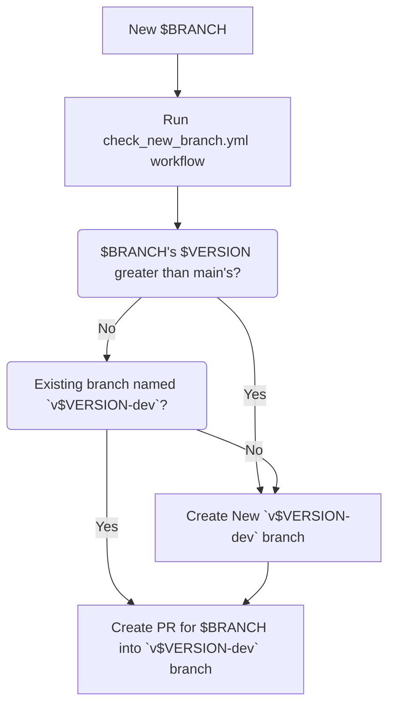
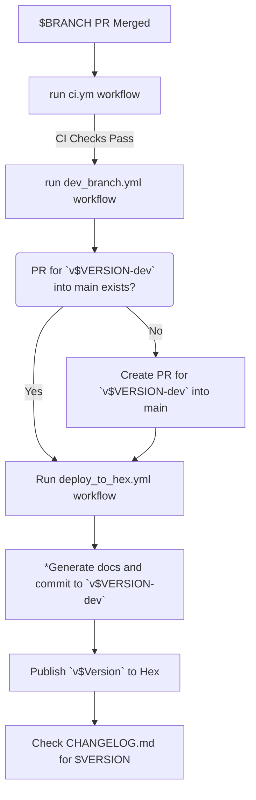

# TodoTxt
[Online Documentation](https://hexdocs.pm/todo_txt/Todo.html).

`TodoTxt` An Elixir library for parseing todo.txt files

## About Todo.txt
More information about todo.txt can be found at:
  - [Overview](https://github.com/todotxt/todo.txt)
  - [Homepage](http://todotxt.org/)
  - [cli](https://github.com/todotxt/todo.txt-cli)

## Installation

This package can be installed
by adding `todo_txt` to your list of dependencies in `mix.exs`:

```elixir
def deps do
  [
    {:todo_txt, "~> 0.2.0"}
  ]
end
```

## Basic Usage

### Read Todos From todo.txt File

```elixir
todos =
  File.read!("todo.txt")
  |> String.split("\n")
  |> Enum.map(&Todo.parse/1)
```

### Write Todos To todo.txt File

```elixir
to_write =
  todos
  |> Enum.map(&Todo.to_string/1)
  |> Enum.join("\n")

File.write!("todo.txt.diff", to_write)
```

### Remove Done Todos From todo.txt And Archive Them In done.txt File
```elixir
todos = File.read!("todo.txt") |> String.split("\n") |> Enum.map(&Todo.parse/1)
{done, todo} = Enum.split_with(todos, fn t -> t.done end)

File.write!("todo.txt", Enum.join(Enum.map(todo, &Todo.to_string/1), "\n"))
File.write!("done.txt", Enum.join(Enum.map(done, &Todo.to_string/1), "\n"))
```

## CI/CD Publishing
GitHub Actions Workflows are used to manage the publishing of new versions to [Hex PM](https://hexdocs.pm/)

### CI Workflows
- [ci.yml](.github/workflows/ci.yml) runs each time a PR is merged

### CD
This process assumes each merged PR passes CI checks before being merged

#### New Branch Workflow
- [check_new_branch.yml](.github/workflows/check_version_branch.yml)


#### Merge Into Dev Branch Workflow
- [dev_branch.yml](.github/workflows/dev_branch.yml)
- [deploy_to_hex.yml](.github/workflows/deploy_to_hex.yml)


#### Merge Into Main Branch Workflow
- [deploy_new_version.yml](.github/workflows/merged_into_dev_branch.yml)
- [deploy_to_hex.yml](.github/workflows/deploy_to_hex.yml)
```mermaid
graph TD
    J["`v$VERSION-dev` PR merged into main"] --> J1["run ci.yml workflow"]
    J1 -->|CI Checks Pass| J2["run deploy_new_version.yml workflow"]
    J2 --> J3["Create `v$VERSION` tag"]
    J3 --> K["Create `v$VERSION` release"]
    K --> L["Run deploy_to_hex.yml workflow"]
    L --> L1["Publish `v$Version` to Hex"]
    L1 --> L2["Delete v$VERSION-dev` package from Hex"]
```

## Roadmap
- Add a File Watcher for Local todo.txt
- Add a File Watcher for Google Drive todo.txt
